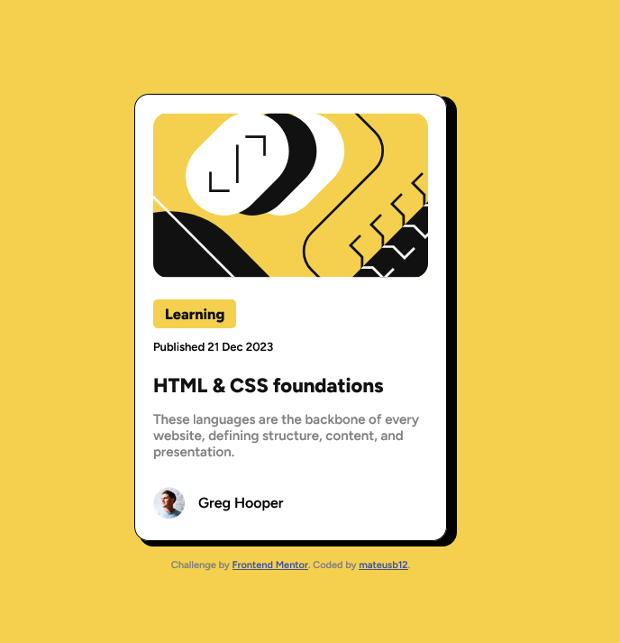

# Frontend Mentor - Blog preview card solution

This is a solution to the [Blog preview card challenge on Frontend Mentor](https://www.frontendmentor.io/challenges/blog-preview-card-ckPaj01IcS). Frontend Mentor challenges help you improve your coding skills by building realistic projects.

## Table of contents

- [Overview](#overview)
  - [The challenge](#the-challenge)
  - [Screenshot](#screenshot)
  - [Links](#links)
- [My process](#my-process)
  - [Built with](#built-with)
  - [What I learned](#what-i-learned)
  - [Continued development](#continued-development)
  - [Useful resources](#useful-resources)
- [Author](#author)
- [Acknowledgments](#acknowledgments)

**Note: Delete this note and update the table of contents based on what sections you keep.**

## Overview

### The challenge

Users should be able to:

- See hover and focus states for all interactive elements on the page

### Screenshot



### Links

- Solution URL: [https://github.com/mateusb12/frontend-mentor-blog-preview-card-main](https://your-solution-url.com)
- Live Site URL: [Add live site URL here](https://your-live-site-url.com)

## My process

### Built with

- Semantic HTML5 markup
- CSS custom properties
- Flexbox
- CSS Grid
- Mobile-first workflow
- [React](https://reactjs.org/) - JS library
- [Next.js](https://nextjs.org/) - React framework
- [Styled Components](https://styled-components.com/) - For styles

**Note: These are just examples. Delete this note and replace the list above with your own choices**

### What I learned

- I can set the colors as variables in css
```css
:root {
    --yellow: hsl(47, 88%, 63%);
    --black: hsl(0, 0%, 7%);
    --shadow: hsl(0, 0%, 0%);
    --white: hsl(0, 0%, 100%);
    --grey: hsl(0, 0%, 50%);
    --card-margin: 1em;
}
```
- I can use @font-face to setup font config
```css
@font-face {
  font-family: 'Figtree';
  src: url('assets/fonts/static/Figtree-SemiBold.ttf') format('truetype');
  font-weight: 500;
  font-style: normal;
}
```
- It's better to use rem than px to set up responsive design
```css
.div {
  height: 31.2rem;
}
```
- I can use a div::before to create shadows
```css
.card::before{
    content: "";
    position: absolute;
    top: 0.2vh;
    left: 0.2vw;
    height: 31.2rem;
    width: 22.1rem;
    border-radius: 16px;
    background-color: black;
    z-index: -1;
}
```
- Setting the tag "position: relative" on the father chiv sets its as the reference point (anchor) for any absolutely positioned children elements
```css
.card {
    position: relative;
}
```
- "display: inline-block;" makes the element width to be limited to what is really needed 
-  The elements are `(<span>`, `<a>`, ``)
```css
.learning {
    display: inline-block;
    font-size: 1.02em;
    font-weight: 700;
}
```
- In order to remove the underline from a link `(<a>)` you can use `"text-decoration: none;"`
```css
.foundations a{
    color: black;
    text-decoration: none;
}
```


### Continued development

I want to continue working on
- flexbox
- responsive design
- after-before design

### Useful resources

- [Example resource 1](https://www.example.com) - This helped me for XYZ reason. I really liked this pattern and will use it going forward.
- [Example resource 2](https://www.example.com) - This is an amazing article which helped me finally understand XYZ. I'd recommend it to anyone still learning this concept.

**Note: Delete this note and replace the list above with resources that helped you during the challenge. These could come in handy for anyone viewing your solution or for yourself when you look back on this project in the future.**

## Author

- Website - [Add your name here](https://www.your-site.com)
- Frontend Mentor - [@yourusername](https://www.frontendmentor.io/profile/yourusername)
- Twitter - [@yourusername](https://www.twitter.com/yourusername)

**Note: Delete this note and add/remove/edit lines above based on what links you'd like to share.**

## Acknowledgments

This is where you can give a hat tip to anyone who helped you out on this project. Perhaps you worked in a team or got some inspiration from someone else's solution. This is the perfect place to give them some credit.

**Note: Delete this note and edit this section's content as necessary. If you completed this challenge by yourself, feel free to delete this section entirely.**
