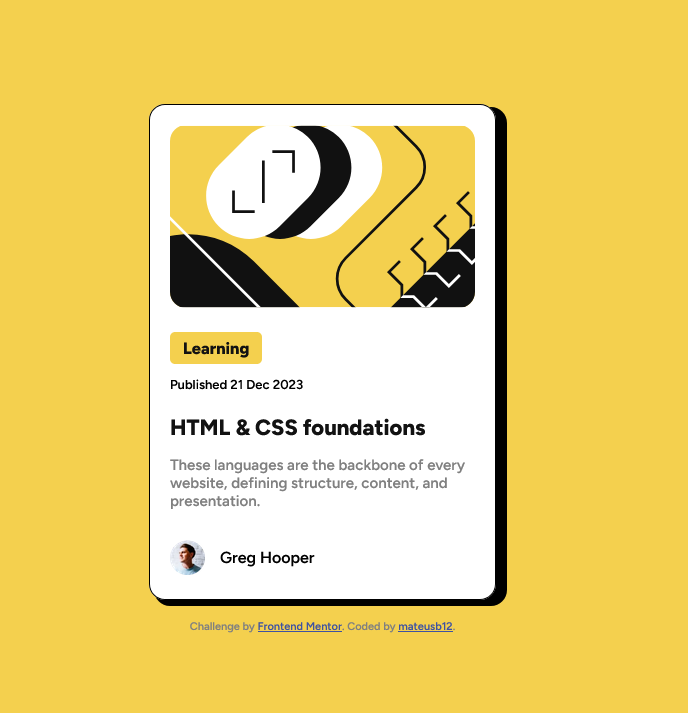

# Frontend Mentor - Blog preview card solution

This is a solution to the [Blog preview card challenge on Frontend Mentor](https://www.frontendmentor.io/challenges/blog-preview-card-ckPaj01IcS). Frontend Mentor challenges help you improve your coding skills by building realistic projects.

## Table of contents

- [Overview](#overview)
    - [The challenge](#the-challenge)
    - [Screenshot](#screenshot)
    - [Links](#links)
- [My process](#my-process)
    - [Built with](#built-with)
    - [What I learned](#what-i-learned)
    - [Continued development](#continued-development)
    - [Useful resources](#useful-resources)
- [Author](#author)
- [Acknowledgments](#acknowledgments)

**Note: Delete this note and update the table of contents based on what sections you keep.**

## Overview

### The challenge

Users should be able to
- See hover and focus states for all interactive elements on the page

### Screenshot



### Links

- Solution URL: [https://github.com/mateusb12/frontend-mentor-blog-preview-card-main](https://your-solution-url.com)
- Live Site URL: [Add live site URL here](https://your-live-site-url.com)

## My process

### Built with

- Semantic HTML5 markup
- CSS custom properties
- Flexbox

### What I learned

- I can set the colors as variables in css
```css
:root {
    --yellow: hsl(47, 88%, 63%);
    --black: hsl(0, 0%, 7%);
    --shadow: hsl(0, 0%, 0%);
    --white: hsl(0, 0%, 100%);
    --grey: hsl(0, 0%, 50%);
    --card-margin: 1em;
}
```
- I can use @font-face to setup font config
```css
@font-face {
  font-family: 'Figtree';
  src: url('assets/fonts/static/Figtree-SemiBold.ttf') format('truetype');
  font-weight: 500;
  font-style: normal;
}
```
- It's better to use rem than px to set up responsive design
```css
.div {
  height: 31.2rem;
}
```
- I can use a div::before to create shadows
```css
.card::before{
    content: "";
    position: absolute;
    border-radius: 16px;
    background-color: black;
    z-index: -1;
}
```
- Setting the tag "position: relative" on the father chiv sets its as the reference point (anchor) for any absolutely positioned children elements
```css
.card {
    position: relative;
}
```
- "display: inline-block;" makes the element width to be limited to what is really needed
-  The elements are `(<span>`, `<a>`, ``)
```css
.learning {
    display: inline-block;
    font-size: 1.02em;
    font-weight: 700;
}
```
- In order to remove the underline from a link `(<a>)` you can use `"text-decoration: none;"`
```css
.foundations a{
    color: black;
    text-decoration: none;
}
```


### Continued development

I want to continue working on
- flexbox
- responsive design
- after-before design

### Useful resources

- [Learn CSS Flexbox in easy way](https://youtu.be/rPlwsRJZ_EM?si=wRJloN2iwXjOzfkg) - This helped me for understanding the flexbox concept. I really liked this video. I'd recommend it to anyone still learning this concept.
- [Learn CSS display property in 4 minutes](https://youtu.be/9T8uxp5hQ60?si=b5ou810NaES3NSAe) - This is an amazing video which helped me finally understand the display property concept.

## Author

- Website - [Portfolio](https://mateusb12.github.io/mateus_portfolio/)
- Frontend Mentor - [@mateusb12](https://www.frontendmentor.io/profile/yourusername)

## Acknowledgments

This is where you can give a hat tip to anyone who helped you out on this project. Perhaps you worked in a team or got some inspiration from someone else's solution. This is the perfect place to give them some credit.


